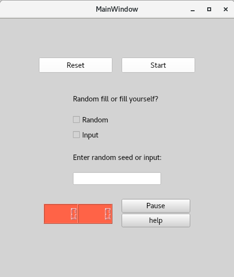
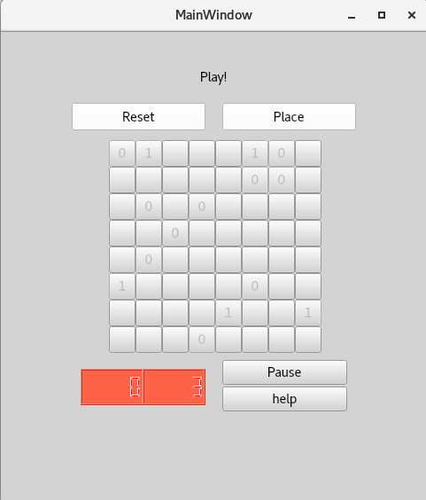
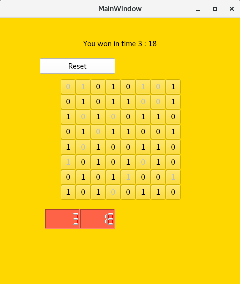

# binairo
Final project for Tampere University's Programming 2 course. Gameboard class (gameboard.hh and gameboard.cpp) was provided by course staff.

### Game rules
Objective of the game is to fill the board (8X8 if not changed) with 0s and 1s with the following rules as fast as possible:
- each row and column must have same number of 0s and 1s.
- Three or more of the same number in a row is prohibited in every row and column.
At first user chooses between filling the board randomly or himself. If user chooses to fill the board himself,
he/she cannot break previously said rules. When starting method is selected and seed/input is written, press 'Start'. During and after
the game user can start completely new game by clicking 'reset'.

### How to play

- At first user chooses between filling the board randomly or himself. If user chooses to fill the board himself,
he/she cannot break previously said rules. Input should be row * column sized with marks '0', '1' or ' '.
If user chooses random board, seed should be [1..50] but not one of these: { 2, 8, 12, 13, 16, 20, 21, 23, 26, 29, 31, 32, 34, 41, 42, 43, 44, 46 }
- When starting method is selected and seed/input is written, press 'Start'. During and after
the game user can start completely new game by clicking 'reset'.
- User can fill squares by clicking on them multiple times:
1 click = 0, 2 clicks = 1, and 3 clicks = empty square again. Right and wrong fills are allowed until 'Place'
button is clicked. If there is incorrectly filled squares, program will tell and they will turn red.
Once the button is pressed, you cannot change correctly put squares. Be careful before pressing 'Place'!
It is possible to legally fill squares so that game cannot by completed anymore.
Game is over when board is full and the time used is shown. There is option to pause the game and see 
rules.

  

### Description of the code.
- Code works by hiding and showing the right buttons at the right time. For example when game is started, 'checkbox_random', 'checkbox_input' and other useless features are hidden. They are shown again when 'pushbutton_reset' is pressed.
- Gameboard is generated when 'pushbutton_start' is pressed. draw_board()- method copies board_- map from GameBoard class to different map called 'buttons_'. buttons_ contains QPushbutton objects. Each empty button can show 0, 1 or empty.
- When 'pushbutton_place_number' (Place button) is pressed, 'on_pushbutton_place_number_clicked()' iterates through every button/square that is edited and checks using gameboard class if its correctly placed. If yes, it is saved to the original board_ map and button is locked. If no, text in button turns red and can still be edited. 
- When 'pushbutton_reset()' is pressed, gameboard disappears by removing every QPushbutton objects from map. Timer also start/stops when Start and Reset buttons are pressed.
- ##### Public Methods for **`mainwindow`** class:
  - **`MainWindow(QWidget *parent = nullptr)`**: Constructor that initializes the main window and sets up the user interface. It applies default styling, hides certain UI elements, and sets up a timer for the game.
  - **`~MainWindow()`**: Destructor that cleans up the allocated resources and UI components.
  - **`void on_pushbutton_start_clicked()`**: Slot triggered when the "Start" button is clicked. It handles the initialization of the game based on the selected input mode (random or manual), validates input, and starts the game.
  - **`void handle_clicks()`**: Slot triggered when a grid button is clicked. It toggles the value of the button between "0", "1", and empty. It also ensures the correct interaction with the game state.
  - **`void on_pushbutton_place_number_clicked()`**: Slot triggered when the "Place" button is clicked. It checks if the values in the gameboard are correct, locks valid ones, highlights invalid ones, and checks if the game is over.
  - **`void update_time()`**: Slot that updates the timer's display (minutes and seconds). It is triggered every second while the game is active.
  - **`void on_pushbutton_reset_clicked()`**: Slot triggered when the "Reset" button is clicked. It resets the game state, clears the gameboard, and restores the initial UI state.
  - **`void on_checkbox_random_toggled(bool checked)`**: Slot triggered when the random input checkbox is toggled. It ensures that only one input mode (random or manual) is selected at a time and updates the label accordingly.
  - **`void on_checkbox_input_toggled(bool checked)`**: Slot triggered when the input mode checkbox is toggled. It ensures that only one input mode (random or manual) is selected at a time and updates the label accordingly.
  - **`void on_pushbutton_help_clicked()`**: Slot triggered when the "Help" button is clicked. It toggles the visibility of the text browser displaying the game rules.
  - **`void on_pushbutton_pause_clicked()`**: Slot triggered when the "Pause" button is clicked. It pauses or resumes the game and hides/shows relevant UI elements.
  - **`void draw_board()`**: Private method that generates the gameboard UI. It creates a grid of `QPushButton` objects, each representing a cell in the game. These buttons are connected to the `handle_clicks()` method.
- ##### Public Methods for **`GameBoard`** class:
  - **`GameBoard()`**: Constructor initializes the board with all cells set to `EMPTY`.
  - **`fill_randomly(seed)`**: Populates the board randomly based on a seed, ensuring valid symbol distribution. Returns `false` for invalid seeds.
  - **`fill_from_input(input)`**: Initializes the board with a user-provided string. Validates input size and symbols before applying.
  - **`ok_adjacent_symbols()`**: Verifies that adjacent symbol rules are adhered to across the board.
  - **`ok_amount_of_symbols()`**: Checks that symbol counts in rows and columns do not exceed the allowed limit.
  - **`add_symbol(x, y, symbol_char)`**: Attempts to add a symbol at specified coordinates if it doesn't violate game rules. Returns success status.
  - **`is_game_over()`**: Determines if the game is complete (no `EMPTY` cells).
  - **`print()`**: Prints the board to the console for visualization.
  - **`return_board()`**: Provides the current board state as a 2D vector of strings.
- ##### Constants for **`mainwindow`** class:
  - **`const int MARGIN = 61;`**: Defines the margin around the gameboard for positioning the buttons.
  - **`const int SIZE = 30;`**: Defines the size of each button representing a cell in the gameboard.
  - **`QTimer* timer`**: A pointer to the `QTimer` used to update the game's timer every second.
  - **`int minutes_ = 0;`**: Tracks the number of minutes elapsed in the game.
  - **`int seconds_ = 0;`**: Tracks the number of seconds elapsed in the game.
  - **`bool random_input = true;`**: A flag indicating whether the input mode is set to random or manual. It is set to `true` by default.
  - **`std::vector<std::vector<QPushButton*>> buttons_;`**: Stores the grid of `QPushButton` objects representing the gameboard's cells.
- ##### Constants for **`GameBoard`** class:
  - **`NUMBER_OF_SYMBOLS`**: Maximum count of each symbol (`ZERO` and `ONE`) allowed per row/column.
  - **`SIZE`**: Total number of rows/columns, calculated as `2 * NUMBER_OF_SYMBOLS`.
  - **`DISTR_UPPER_BOUND`**: Defines the range for random symbol distribution.
  - **`LEFT_COLUMN_WIDTH`**: Adjusts alignment for board printing.
  - **`BAD_SEEDS`**: List of seeds known to produce unsolvable boards.
